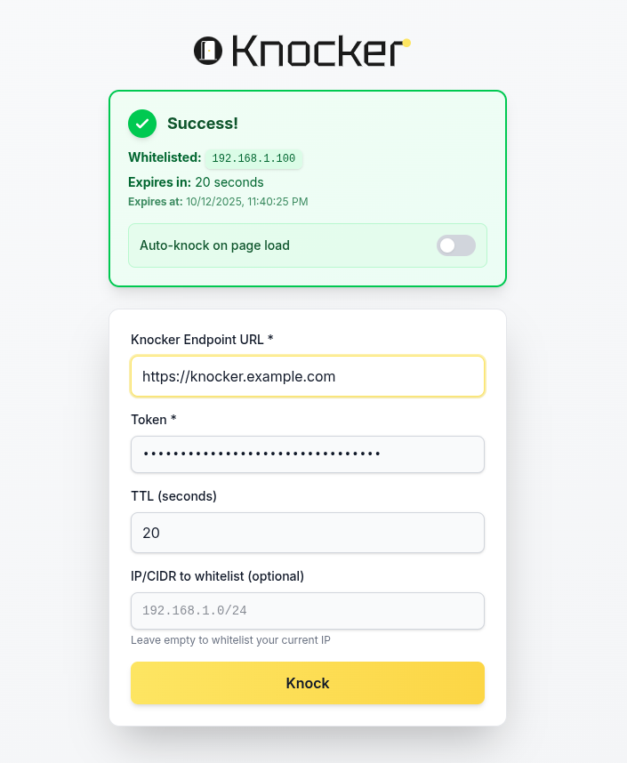

# Knocker Web

 [](https://github.com/FarisZR/knocker-web/blob/main/LICENSE)




A client-side web application for interacting with [Knocker](https://github.com/FarisZR/knocker), a token-based IP whitelisting solution.

## About

Knocker Web provides a user-friendly interface for managing IP whitelisting through the Knocker API. It features:

- **Client-side operation**: No backend required, all processing happens in your browser
- **Session persistence**: Your settings are saved for convenience (in browser session storage)
- **Auto-knock**: Automatically whitelist your IP on page load
- **Dark mode support**: Elegant UI with light and dark themes
- **TTL management**: Configure Time-To-Live for whitelist entries with warnings when capped
- **Remote whitelisting**: Support for whitelisting specific IP/CIDR ranges (requires admin token)

## Tech Stack

- [Vite 6](https://vitejs.dev) with [React 19](https://reactjs.org), [TypeScript 5](https://www.typescriptlang.org) and [absolute imports](https://github.com/aleclarson/vite-tsconfig-paths).
- [Tailwind CSS v4](https://tailwindcss.com) for styling with custom accent color (#fde562).
- [TanStack Query](https://tanstack.com/query) for API state management.
- [Valibot](https://valibot.dev) for runtime type validation.
- [Biome V2](https://next.biomejs.dev) for linting, formatting and automatic import sorting.
- Comprehensive testing with [Vitest 3](https://vitest.dev/), [Testing Library 16](https://testing-library.com/), and [MSW](https://mswjs.io).
- E2E tests with [Playwright 1.52](https://playwright.dev).

## Getting started

Clone the repository and install dependencies:

```bash
git clone https://github.com/FarisZR/knocker-web.git
cd knocker-web
pnpm install
```

## Usage

1. **Start the preview server**:
   ```bash
   pnpm preview
   ```

2. **Enter your Knocker details**:
   - Knocker Endpoint URL (e.g., `https://knocker.example.com`)
   - API Token
   - (Optional) TTL in seconds
   - (Optional) IP/CIDR to whitelist

3. **Click "Knock"** to whitelist your IP

Your settings will be saved in the browser session. To enable auto-knock on page load, add `?autoKnock=true` to the URL.

## Scripts

- `pnpm dev` - start a development server with hot reload.
- `pnpm build` - build for production. The generated files will be on the `dist` folder.
- `pnpm preview` - locally preview the production build.
- `pnpm test` - run unit and integration tests related to changed files based on git.
- `pnpm test:ci` - run all unit and integration tests in CI mode.
- `pnpm test:e2e` - run all e2e tests with Playwright.
- `pnpm test:e2e:ci` - run all e2e tests headlessly.
- `pnpm format` - format all files with Biome Formatter.
- `pnpm lint` - runs TypeScript and Biome.
- `pnpm validate` - runs `lint`, `test:ci` and `test:e2e:ci`.
